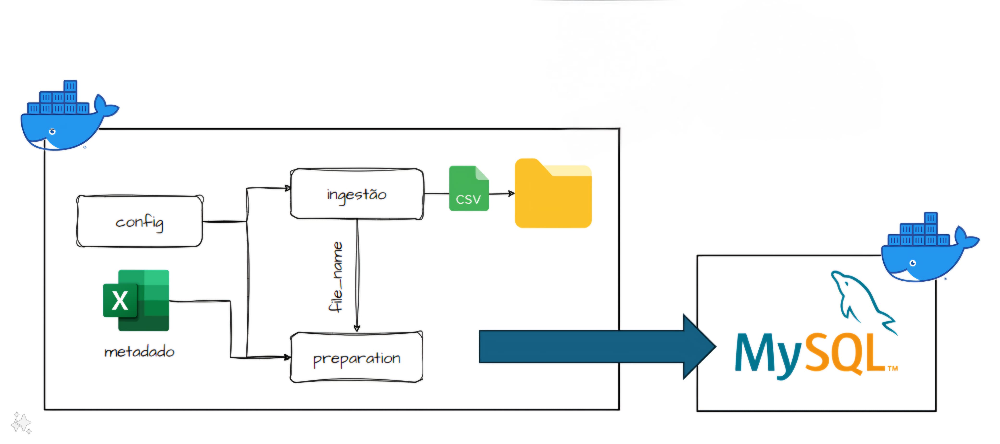

# Projeto DataOps - Develop and Deliver Analytics

## Faculdade Impacta - Curso: MBA Data Engineering

Este é um projeto de DataOps para realizar a ingestão, preparação e armazenamento de dados provenientes da API `randomuser.me`. O projeto abrange desde a obtenção dos dados brutos até o armazenamento dos dados saneados em uma tabela MySQL, garantindo tratamentos mínimos e registro de logs para cada etapa do processo.

## Escopo do Projeto


## Origem dos Dados

Os dados são obtidos a partir da API `randomuser.me` com a seguinte URL: [https://randomuser.me/api/?results=10](https://randomuser.me/api/?results=10)

## Requisitos do Sistema

### Armazenamento de Dados

- Os dados brutos são armazenados em um diretório específico.
- Os dados saneados são armazenados em uma tabela MySQL.

### Tratamentos Mínimos dos Dados

- Tratamento de tipos.
- Tratamento de nomes.
- Padronização dos dados: remoção dos caracteres especiais e transformação das strings para minúsculas.

### Registros e Tratamento de Exceção

- Inserção de log de informação para cada etapa do processo de ingestão e preparação.
- Tratamento de exceção para cada etapa do processo de ingestão e preparação.

### Componentes

- Dockerfile:
  - Configuração do ambiente Python para a aplicação de ingestão, preparação e armazenamento dos dados.

- Scripts Python com docstring para cada etapa do processo.

- Docker-compose para levantar a aplicação Python e o MySQL.
  - Configuração do MySQL com a criação da tabela.

### Workflow GitActions

- Implementação de um workflow no GitActions que realiza as seguintes ações:
  - Validação do código Python com pylint.
  - Salvamento da imagem da aplicação Python no DockerHub.

## Estrutura do Projeto
```
mba-de-04-dataops-atividade-final/
│
├── .github/
│  └── workflows/
│    └── publish_dockerhub.yml
│
├── imgs/
│    ├── aula02.jpg
│    ├── imagem1.jpeg
│    ├── imagem1.jpeg:Zone.Identifier
│    └── projeto_final.png
│
├── mysql/
│  └── db
│    └── CreateDatabase.sql
│
├── python/
│  └── scripts
│    ├── data
│      └── raw
│        └── .gitkeep
│    ├── config.py
│    ├── config.py
│    ├── ingestion.py
│    ├── metadados.xlsx
│    └── utils.py
│  ├── Dockerfile
│  └── requirements.txt
│
├── .gitignore
├── README.md
└── docker-compose.yml
```

## Integrantes do Grupo

- Alisson Machado Sousa
- Tatiana Fernanda Terra
- Daniel Kardec de Santana Oliveira
- Fábio Augusto de Lorenzo Tavares
- Luis Fernando Joaquim de Sena
- Eduardo Vitor Oliveira Cunha